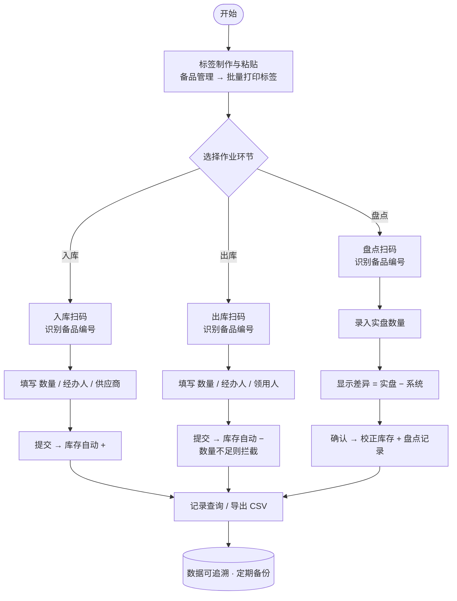

# 二维码仓库管理 — 优化方案与操作流程

> 配套系统：备件仓库管理系统（本地免安装网页版，数据存于浏览器本地）
> 目标：在不改变现有六大模块的前提下，增加**二维码标签**与**扫码作业**能力，覆盖入库、出库、盘点三大核心环节。

---

## 一、总体设计原则

| 原则 | 说明 |
| --- | --- |
| **离线优先** | 二维码生成（`qrcode-generator`）与解码（`jsQR`）库已内置到 `js/vendor/`，**不依赖任何网络/CDN**，断网可用。 |
| **极简编码** | 二维码**只承载备品唯一编号**（ASCII 令牌），如 `SPMS1\|BJ-001`。名称、规格、库位等由系统按编号实时查库补全。 |
| **人机双读** | 标签上除二维码外，同时印刷编号/名称/规格/库位**文字**，扫码失败或人眼核对时仍可读。 |
| **业务解耦** | 扫码是一个独立组件 `openScan(onResolved)`，入库/出库/盘点共用，新增环节只需调用它，扩展成本低。 |
| **无缝衔接** | 扫码结果直接预填现有表单的"备品"选择项，后续录入流程不变，不增加操作负担。 |

### 为什么二维码只存编号？
1. **扫描稳定**：纯 ASCII 内容解码成功率远高于中文 UTF-8（实测 jsQR 对中文字节模式会丢数据）。
2. **抗变更**：备品更名、改规格后，旧二维码依然有效（编号不变）。
3. **码更小更清晰**：内容短 → 二维码模块少 → 打印/手机识别更轻松。
4. **单一数据源**：信息以系统数据库为准，避免标签与系统"两张皮"。

---

## 二、二维码编码规范

- **内容格式**：`SPMS1|<备品编号>`
  - `SPMS1`：系统标识 + 版本号，便于未来扩展为 `SPMS2|...` 承载更多字段。
  - `<备品编号>`：即系统内"编号"字段（如 `BJ-001`），ASCII。
- **纠错等级**：`M`（约 15% 容错），适合仓库标签磨损、污渍场景。
- **标签版面**：二维码（居中）+ 下方四行文字：`编号 / 名称 / 规格 / 库位`。
- **生成方式**：单条"生成二维码"预览下载 PNG；或"批量打印标签"导出整页标签纸直接打印。

---

## 三、核心操作流程

### 总体流程图

> 高清可缩放图另存为 `仓库管理流程图.svg`，可直接用浏览器打开查看。

> 注：扫码识别失败时，弹窗支持**手动输入编号**兜底；双击 `file://` 打开时摄像头自动隐藏，改用"上传图片识别"。

### 环节 0 · 标签制作与粘贴（基础准备，一次性）
1. 进入 **备品管理**，确认 600 种备品已录入（可 CSV 批量导入）。
2. 点击 **批量打印标签**（或逐条"二维码"→打印），打印标签纸。
3. 将标签贴到对应**实物**与**库位**上，确保扫码可达。

### 环节 1 · 入库扫码
1. 进入 **入库管理** → 点击 **扫码**。
2. 在弹窗中选择：
   - **上传图片识别**（离线可用）：对实物/库位标签拍照后上传，系统自动识别；
   - **摄像头扫码**（以 `http://localhost` 或 `https` 打开时可用）：实时对准二维码。
3. 识别成功后，系统**自动选中对应备品**，关闭弹窗。
4. 填写 入库数量 / 经办人 / 供应商 → 提交，**库存自动增加**。

### 环节 2 · 出库扫码
1. 进入 **出库管理** → 点击 **扫码**，识别备品（同环节 1）。
2. 填写 出库数量 / 经办人 / 领用人或用途 → 提交。
3. 系统**自动扣减库存**；若数量 > 当前库存，弹窗拦截并提示缺口。

### 环节 3 · 盘点扫码
1. 进入 **盘点** → 点击 **扫码**（或下拉选择）定位备品。
2. 输入**实盘数量**。
3. 系统即时显示：系统库存、实盘数量、**差异（实盘−系统）**。
4. 确认后生成一条**盘点记录**（写入流水，可追溯），并按实盘数量**校正库存**。
5. 盘点差异可在 **记录查询** 中按"盘点"类型筛选复盘。

### 环节 4 · 异常处理
- **扫码无匹配**：提示"编号不存在"，引导先到 **备品管理** 建档后再贴标。
- **标签模糊/破损**：支持弹窗内**手动输入编号**兜底；建议重打标签。
- **摄像头不可用**（直接双击 `file://` 打开时浏览器禁用摄像头）：弹窗**自动隐藏摄像头页**，仅保留"上传图片识别"，不影响作业。

---

## 四、数据准确性与可扩展性保障

### 准确性
- 扫码只取"编号"，从根上杜绝人工选错备品。
- 盘点提交前显式展示**差异**，强制人工确认后再校正。
- 入库/出库/盘点**全部写流水记录**，任何变动可追溯、可导出。

### 可扩展性
- **令牌版本化**：`SPMS1` 前缀为未来扩展预留（如 `SPMS2` 可承载批次、序列号）。
- **扫码组件复用**：`openScan(callback)` 与具体业务解耦，新增"移库""借出"等环节只需调用它并接表单。
- **库可替换**：解码库 `jsQR`、生成库 `qrcode-generator` 均为标准 MIT 库，后续可平滑替换为更强引擎。
- **打印可定制**：标签版面为独立模板函数，调整尺寸/字段只需改一处。

---

## 五、与现有系统的衔接点（实现对照）

| 现有模块 | 二维码增强 |
| --- | --- |
| 备品管理 | 新增"二维码"按钮（单条预览/下载/打印）；顶部新增"批量打印标签" |
| 入库管理 | 表单上方新增"扫码"按钮，识别后自动选中备品 |
| 出库管理 | 同上 |
| 库存管理 | 不变（盘点差异来源） |
| 库位管理 | 不变（标签已含库位文字） |
| 记录查询 | 类型筛选新增"盘点"，盘点记录可查可导出 |
| 新增：盘点 | 独立导航项，扫码/选择→实盘→差异→校正+记录 |

> 注：摄像头实时扫码需要"安全上下文"。直接双击以 `file://` 打开时浏览器会禁用摄像头，此时系统自动降级为"上传图片识别"（离线可用，体验几乎一致）；若需摄像头，用 `python -m http.server` 起本地服务后以 `http://localhost:8000` 打开即可。
